# Omacade

**Insert no coins.** Omacade is a modular, theme-aware arcade for
[Omarchy](https://omarchy.org/) with five original cabinets, one local pilot
profile, persistent records and achievements, and a full-stack Circuit mode.

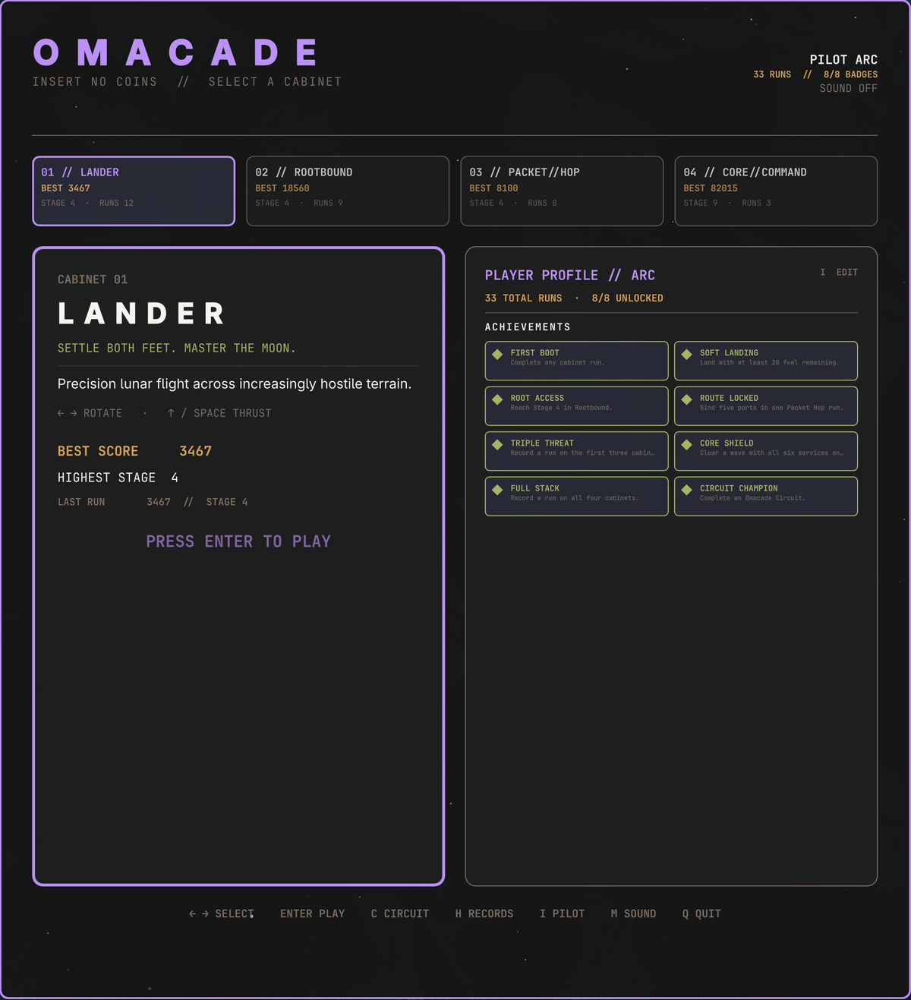

## Preview

<p align="center">
  <video src="docs/videos/theme-showcase.mp4" controls width="720"></video>
</p>

<p align="center">
  <video src="docs/videos/daemon-swarm-gameplay.mp4" controls width="372"></video>
  <video src="docs/videos/lander-gameplay.mp4" controls width="372"></video>
</p>

## The cabinets

### 01 // Lander

Precision lunar flight inspired by the classic landing genre. Rotate the craft,
manage limited fuel, and settle both feet onto one of two illuminated pads. The
narrower pad pays more, while Cadet, Pilot, and Ace tighten the safe velocity
and attitude limits.

Every successful landing opens a harder stage with narrower pads, taller
mountains, deeper craters, rougher ground, and increasingly hostile approaches.
The cabinet adds a rotating pixel-art lander, engine plume, touchdown dust,
crash debris, twinkling stars, and occasional comets over a generated lunar
surface.

<p align="center">
  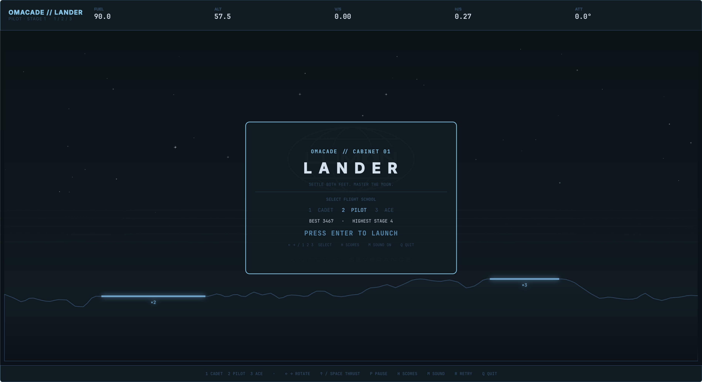
  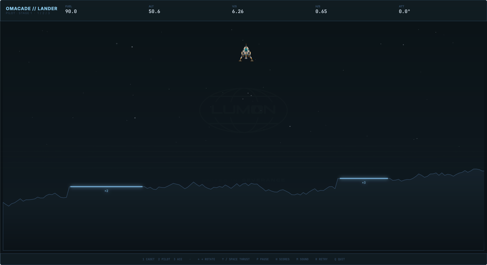
</p>

**Controls:** `←` / `A` and `→` / `D` rotate; `↑` / `W` / `Space` thrust;
`1` / `2` / `3` select Cadet, Pilot, or Ace.

### 02 // Rootbound

A filesystem action game inspired by underground arcade combat. Dig through
block storage, recover package shards, and use a `sudo purge` pulse to quarantine
rogue daemons before they overrun the mount.

Its four zones—`/home`, `/var`, `/tmp`, and `/root`—change tunnel topology,
digging resistance, daemon behavior, hazards, and bonus objectives. Later zones
introduce moving log blocks, rebuilding cache cells, unstable terrain, and
timed firewall gates rather than merely making the same enemies faster.

<p align="center">
  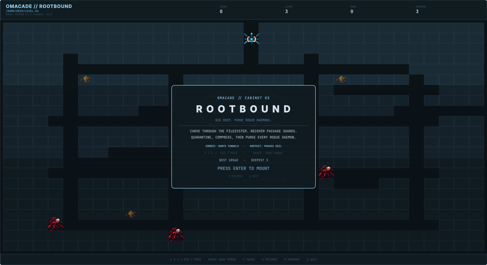
  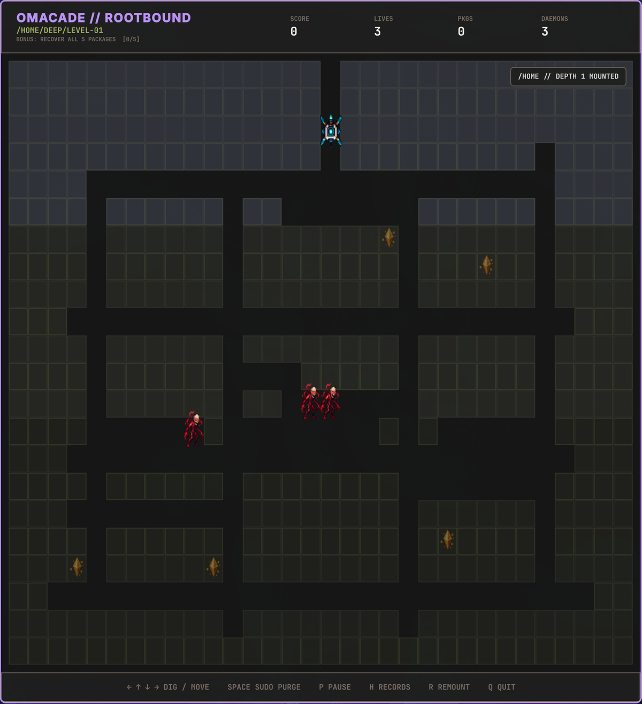
</p>

**Controls:** arrows or `WASD` dig and move; hold `Space` to charge and route a
purge pulse through connected tunnels.

### 03 // Packet Hop

A network-crossing game inspired by lane-dodging arcades. Route a packet through
hostile process traffic, ride encrypted carriers across the transit layer, and
bind all five root ports before TTL expires.

The `/LAN`, `/WAN`, `/VPN`, and `/ROOT` routes introduce switches, firewalls,
DPI beams, SSH carriers, VPN relays, and progressively tighter TTL budgets.
Telegraphed cache hits, packet-loss windows, traffic bursts, and route flaps
temporarily rewrite a lane's rules while the ingress and egress rails explain
exactly what changed.

<p align="center">
  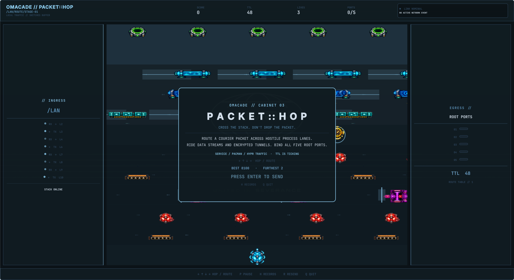
  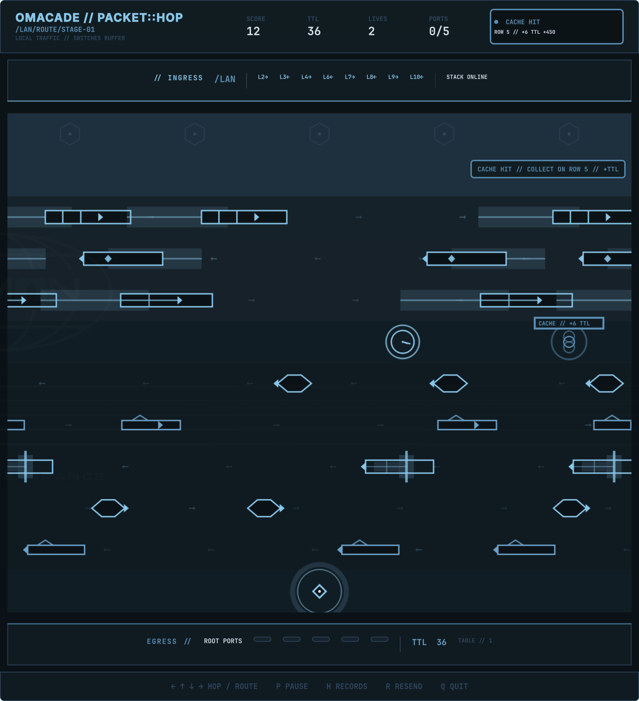
</p>

**Controls:** arrows or `WASD` hop one route cell at a time. Time each move from
the visible sprite gaps—the logical board always preserves square cells.

### 04 // Core Command

A stack-defense game inspired by missile-command arcades. Aim three firewall
batteries, launch limited interceptors, and detonate expanding quarantine fields
to catch inbound payloads and build cascading score chains.

Six critical services each power a defensive ability; losing one changes how
the stack plays. Later waves add fork bombs, stealth payloads, diving rootkits,
salvos, and rotating three-layer zero-day sieges. Ammunition, battery cooldowns,
a shared launch bus, and two in-flight slots per node reward deliberate shots
instead of screen flooding.

<p align="center">
  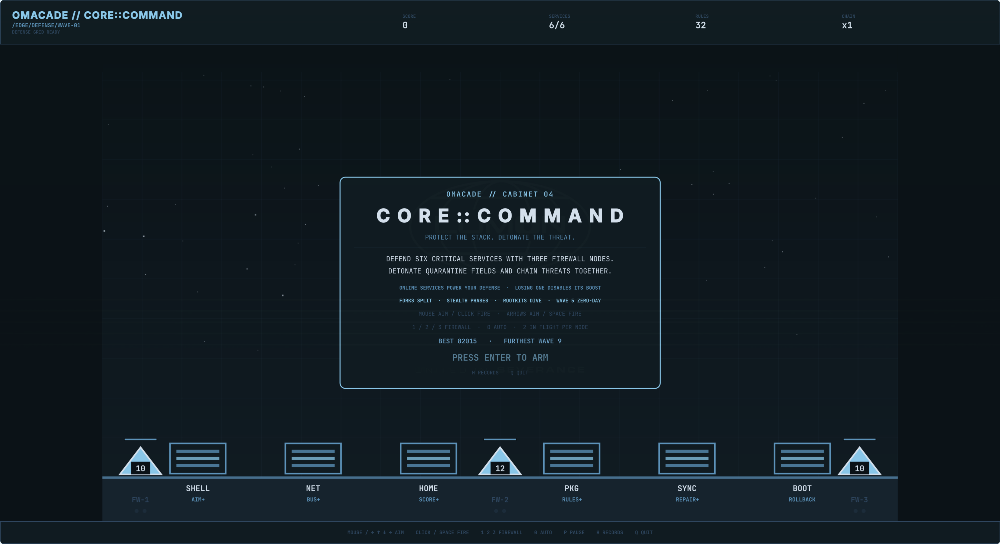
  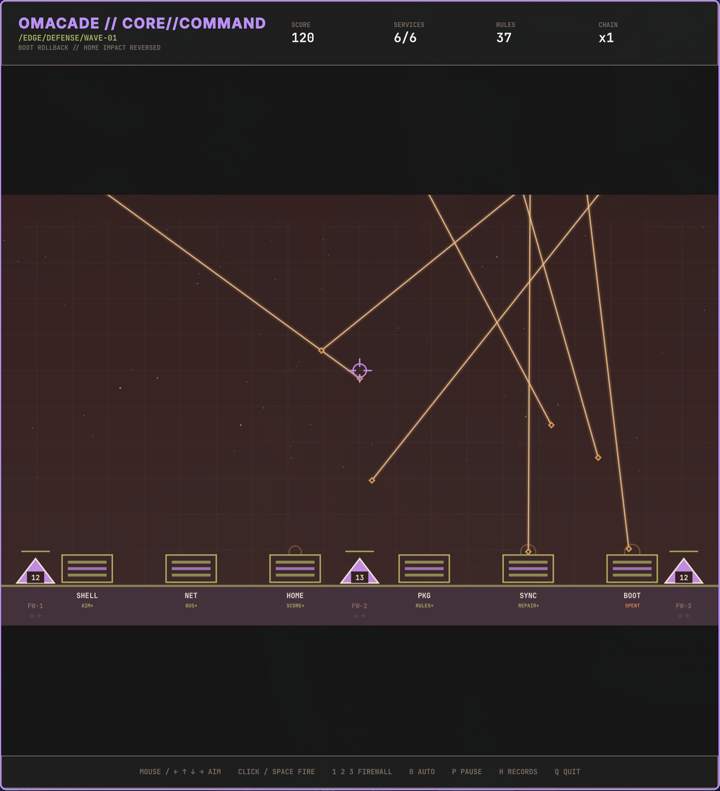
</p>

**Controls:** mouse or arrows / `WASD` aim; click or `Space` fires; `1` / `2` /
`3` select a firewall battery and `0` returns to automatic selection.

### 05 // Daemon Swarm

A super-lite survivors game. One security daemon, an endless run of
escalating waves of rogue processes, and no aiming — your loadout auto-fires
at the nearest threat. Collect packets dropped by kills to level up and pick
new defenses — a piercing packet burst, a pulsing firewall ring, an orbiting
patch shard, chain-lightning traceroute arcs, or proximity honeypot mines —
with no cap on how far any of them can be stacked.

Each wave takes more kills to clear than the last; clearing one banks a free
wave reward (a heal, a burst of bonus packets, a full weapon recharge, brief
invulnerability, or a score surge) before the next wave begins. Forks split
into two on death, trojans hit harder and soak more damage, and from wave 6
onward a rootkit elite periodically breaches with a telegraphed warning.
Threat level escalates from LOW to CRITICAL as the waves climb, and enemy
strength keeps pace with your build — the only way to stay overpowered for
long is to keep clearing waves faster than they scale.

<p align="center">
  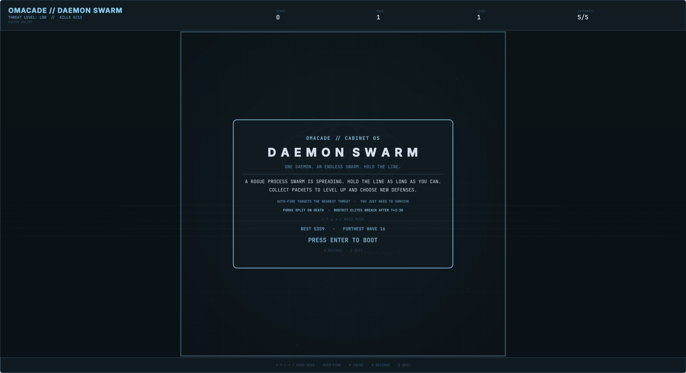
  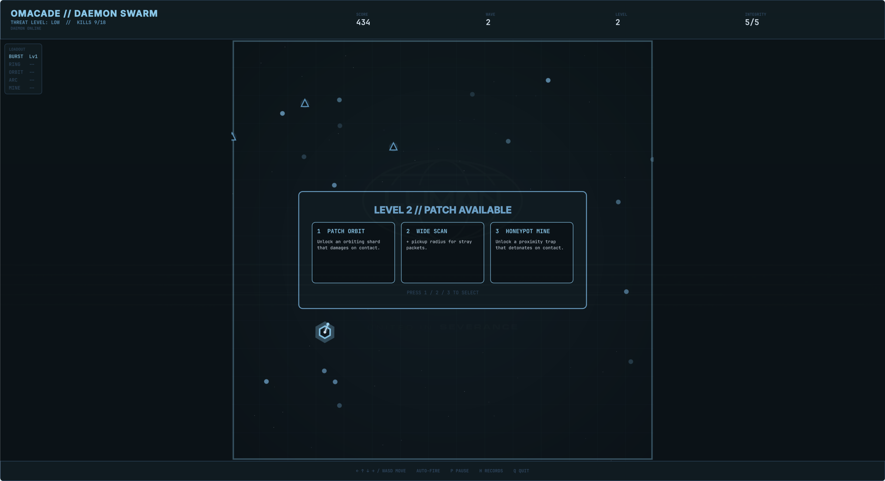
</p>

**Controls:** `←` `→` `↑` `↓` or `WASD` move. Auto-fire always targets the
nearest threat — you just need to keep moving and pick good patches.

## Omacade Circuit

Press `C` in the lobby to run Lander, Rootbound, Packet Hop, Core Command, and
Daemon Swarm as one five-contract challenge. Each cabinet contributes up to
3000 normalized points based on its own objectives rather than incomparable
raw scores.

Two continues let you replay a completed contract before locking its result.
The final screen records every split, remaining continues, total full-stack
score, and the Circuit Champion achievement. If a cabinet is closed before it
records a result, the lobby reports a lost cabinet signal and offers recovery
instead of inventing a score.

## Shared arcade features

- Native graphical windows that tile and resize with Hyprland.
- Live colors from the active Omarchy theme.
- Responsive playfields with preserved sprite and collision geometry.
- Keyboard-first attract screens, pause states, records, initials, and restart
  flows.
- One persistent three-character pilot identity across all cabinets.
- Separate top-ten tables, run counts, personal bests, stage records, session
  recaps, and eight cross-cabinet achievements.
- Original raster sprites and synthesized sound effects with a persistent mute
  setting.
- Atomic local score writes and no network access, accounts, or telemetry.
- Independent cabinet processes so game loops do not live inside Omarchy's
  long-running shell.
- Original terminal Lander retained as a fallback.

## Controls

### Lobby

| Key | Action |
|---|---|
| `←` / `→` or `A` / `D` | Select a cabinet |
| `Enter` / `Space` | Launch selected cabinet |
| `C` | Start Omacade Circuit |
| `H` | Open records |
| `I` | Edit pilot initials |
| `M` | Toggle sound |
| `Q` / `Escape` | Quit |

### Common cabinet controls

| Key | Action |
|---|---|
| `P` | Pause / resume |
| `H` | Open or close top-ten records |
| `R` | Restart the current run |
| `Q` / `Escape` | Close cabinet and return to lobby |
| `Enter` | Start, advance, retry, or confirm initials |

A qualifying score opens a classic three-character initials prompt. Saved
initials become the default for future records and Circuit runs.

## Install

No dependencies beyond Omarchy's bundled Quickshell (`qs`) — every sprite,
sound effect, and score file ships in this repository, and nothing reaches
the network at runtime.

Install and enable the bar widget directly from GitHub:

```sh
omarchy plugin add https://github.com/keithnyc/omacade.git --enable
```

Omarchy clones the repository and enables the reviewed bar widget; it does not
execute the optional setup script. The bar icon and panel work immediately. To
also install the `omacade-gui` graphical command, terminal fallback, Super+Space
launcher, and theme-change icon hook, run:

```sh
~/.config/omarchy/plugins/io.github.keithnyc.omacade/scripts/setup-user-entry
```

Then launch the lobby from the bar, Super+Space, or a terminal:

```sh
omacade-gui
```

Launch individual cabinets for development or troubleshooting:

```sh
omacade-gui lander
omacade-gui rootbound
omacade-gui packet-hop
omacade-gui core-command
omacade-gui daemon-swarm
```

The original terminal cabinet remains available with `omacade lander`.

## Local data

- Settings: `~/.local/state/omarchy/omacade.json`
- Scores and progression: `~/.local/share/omacade/scores.json`

Score writes are atomic. Each cabinet retains its ten best rows plus run counts,
the most recent run, cabinet-specific performance fields, and achievement state.
Omacade reads only these files and Omarchy's current theme palette.

## Optional integration removal

If you ran the optional setup script, remove its launcher, commands, and theme
hook before removing the plugin:

```sh
~/.config/omarchy/plugins/io.github.keithnyc.omacade/scripts/remove-user-entry
omarchy plugin remove io.github.keithnyc.omacade
```

## Local development

From the parent directory of this checkout, link it under its manifest ID:

```sh
ln -s "$PWD/omacade" ~/.config/omarchy/plugins/io.github.keithnyc.omacade
omarchy-shell shell rescanPlugins
omarchy plugin enable io.github.keithnyc.omacade
```

Files under `~/.config/omarchy/plugins/` hot-reload. Run the lobby with
`./omacade/omacade-gui`, a direct cabinet with `./omacade/omacade-gui <id>`, or
the terminal fallback with `./omacade/omacade lander`.

Validate the checkout from its parent directory:

```sh
omarchy-plugin-validate ./omacade
python3 -m py_compile ./omacade/omacade
python3 ./omacade/tests/test_omacade.py
```

## Cabinet framework

`game/arcade.qml` is the arcade lobby and process orchestrator. Cabinet identity
and launch metadata live in `game/framework/CabinetRegistry.js`; reusable theme
and persistence services live beside it. Each game remains an isolated
Quickshell process, so adding a cabinet does not enlarge the bar widget or
couple unrelated game loops together.

Circuit uses timestamped last-run records as a process-safe completion
handshake. See `game/framework/README.md` for the cabinet contract and
[DEVELOPMENT.md](DEVELOPMENT.md) for the complete maintainer handoff, persistence
schema, implementation lessons, test safety, and architectural invariants.

## Roadmap

### Before v1

- Balance Circuit normalization from several complete real-world runs.
- Finish cross-cabinet window-size, input-focus, wording, and sound-level QA.
- Verify a clean install/removal cycle and resolve the marketplace guidance
  around Omacade's intentionally isolated Quickshell game processes.

### After v1

- Daily seeded Circuits and optional run mutators.
- Gamepad support.
- A sixth cabinet when it brings a genuinely different play style.

## License

MIT. See [LICENSE](LICENSE).
